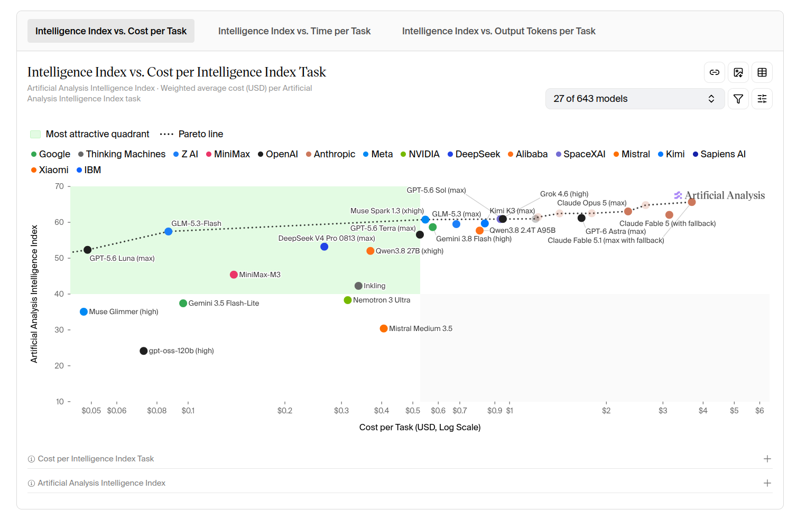
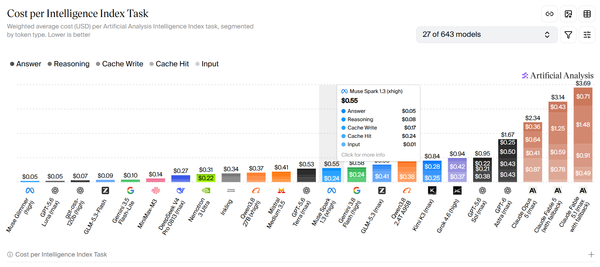
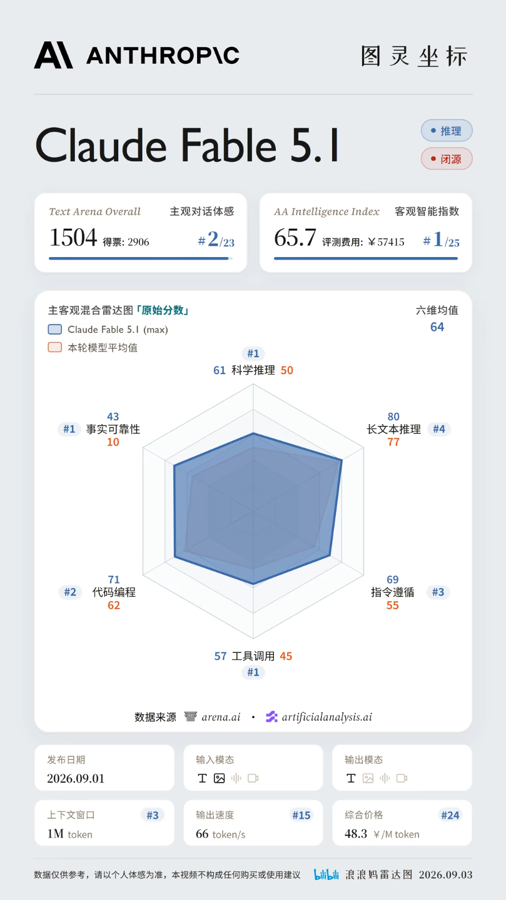
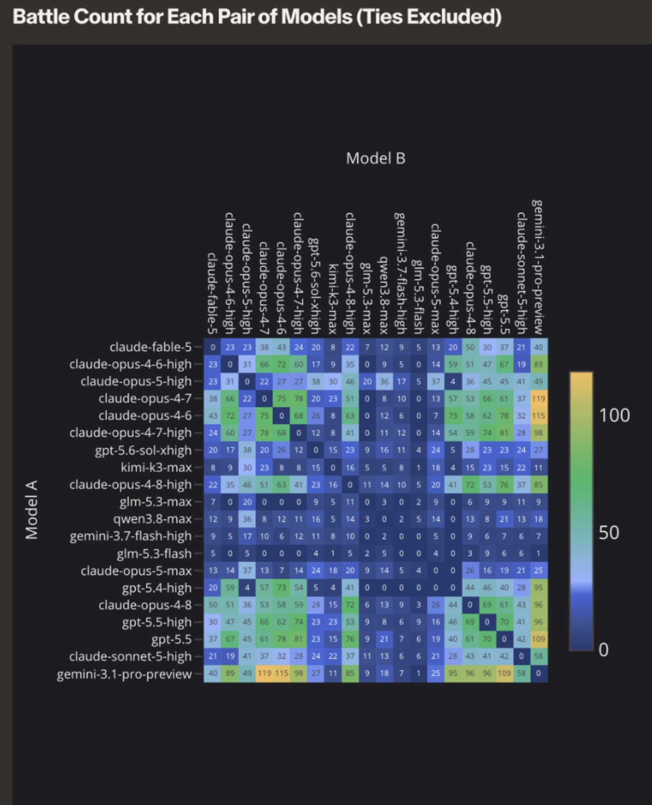

# LLM Picker - What model and coding plan should I choose?

## 1. Topics, Goals, and Questions

LLM agents have become indispensable productivity tools, helping us with all kinds of tasks - coding, research, writing, presentation … There are so many different LLMs available out there, with different payment methods from usage-based billing to subscriptions. Here comes the question - how should I choose the one model / subscription plan that fits my uses and saves money?

That’s why we build this project - we are not only creating clear and easy-to-understand visualizations to compare performance, costs and speed of different models on the market, but also putting the users themselves into the visualization - helping them to make good choices with all these LLM services based on their unique demands.

**Intended Audience**: Users of LLM services

**Questions to Answer**:

- What models are on the pareto front of cost-performance? (i.e. The one model that performs the best among all in its price range)
- What model best fits the task I am working on? (Beyond general “intelligence index”, highlight the varying performance of different models on different tasks. Also take costs and speed into account)
- Should I pay by token or subscribe to a coding plan? Which subscription gives the best value?
- What models / services are people like me using? How do they like them?

## 2. Datasets

1. [LMArena](https://arena.ai/leaderboard/agent)

    - LMArena is a large-scale human preference benchmark that evaluates LLMs through pairwise user comparisons. We plan to obtain its public leaderboard data and apply standard preprocessing to standardize model names, versions, and task categories. We will select approximately 10–20 representative models from major domestic and international providers, such as GPT, Claude, Gemini, Grok, DeepSeek, Qwen, Kimi, MiniMax, GLM, and Doubao. The main attributes will include overall human-preference score, model ranking, confidence intervals, number of votes, and model/provider information. In particular, LMArena provides specialized evaluation dimensions such as Category, Search, and Chart, allowing us to compare models not only by overall preference but also by their performance in different use cases. These dimensions will support task-specific model comparison and recommendation in our final interface.

2. [Artificial Analysis](https://artificialanalysis.ai/)

    - Artificial analysis comes with benchmarks of major LLMs across capability, cost, and inference speed. We plan to use its public leaderboard and data APIs to obtain structured data, using the standard preprocessing methods. We will choose a subset of 10 to 20 models with about 10 attributes each, including benchmark and composite capability scores, input and output token price, average cost per task, output speed, latency, context length, and so on. 

3. User survey in STATS401 class

    - We will obtain respondents’ opinions on the models and plans they are using through a survey as a subjective review. We will group the respondents by their demands (research, coding, reading documents, etc.) and budget, so we can create a simple recommendation system that allows the user to see feedback and suggestions from people like them.

## 3. Analysis and Visualization Methods

We will use Python (Pandas, Numpy) for data acquisition, cleaning, and exploratory analysis. The final interactive visualizations will primarily be implemented using D3.js, with HTML and CSS for the web interface. 

We will integrate data from multiple sources by matching model names and providers, standardize benchmark scores and pricing units, handle missing values, and derive comparison metrics such as average performance and performance-to-cost ratios. 

We are considering techniques such as heatmaps, scatterplots, ranking charts, timelines, and multi-dimensional comparison views to present benchmark performance, cost, speed, model size, and other attributes from different perspectives.

With our visualizations, users can have an overall understanding about the costs and performance of different models. They can also input their demands / preferences and get recommendations of LLMs that best suit their needs.

**User tasks:** comparison, trend identification, exploration

## 4. Visualization Sketches or References

1. Performance vs. Cost per task

This is a scatter plot of performance vs. cost per task of different models. Importantly, it is equipped with a pareto front - the models on the dashed line gives best performance among all models in their price range. The green "most attractive quadrant" indicates models with good price-to-performance ratio.

This kind of plots are very informative for users on choosing the model that gives the best value.

This Cost-per-Intelligence-Index-Task Visualization from [Artificial Analysis](https://artificialanalysis.ai/) shows weighted average cost (USD) per Artificial Analysis Intelligence Index task, segmented by token type. Each bar is divided by different cost type. 

2. Model Card

This is a model card visualization from a [bilibili channel](https://www.bilibili.com/video/BV1nXtX6REt8). It includes performance benchmark, cost, speed and specs in one simple page of visualization. Personally, I really like the radar graph, which gives a good indication of the model's overall performance and how it compares to the average.

This model card visualization is helpful if user wants to learn more about a specific model.

3. Heatmap

Battle Count Heatmap: This heatmap shows the number of direct pairwise comparisons between each pair of models in LMArena, excluding ties. Each cell represents how many times users compared Model A against Model B, with lighter colors indicating more comparisons. It helps reveal which model pairs have stronger human-preference evidence and which have relatively limited comparison data, providing useful context for interpreting Arena scores and rankings.

## 5. Group Roles and Responsibilities

- data acquisition - Siyuan Cao
- data cleaning and processing - Ziyue Zhang
- data analysis - all
- visualization design - all
- D3.js implementation - Ziyue Zhang
- interaction design - all
- interface/web development - Siyuan Cao
- survey portal development - Haoyuan Zheng
- testing - Siyuan Cao
- documentation - Haoyuan Zheng
- presentation preparation - all

## 6. Interim Presentation Deliverables

 1. Collect and clean data from [LMArena](https://arena.ai/leaderboard/agent) and [Artificial Analysis](https://artificialanalysis.ai/).
 2. Explore and design the visualization on these objective data.
 3. Implementation of main visualizations with D3.js
 4. (If good progress) Complete interface/web design
 5. (If very good progress) Implementation of interface/web

## 7. Timeline and Milestones

| Week   | Milestone                   | Tasks       | Responsible Member(s) | Expected Output |
| ------ | --------------------------- | -----       | --------------------- | --------------- |
| Week 2 | Project Definition          | Proposal    | All                   | Proposal        |
| Week 3 | Data Preparation            | 6.1 6.2     | All                   | See Sec 6       |
| Week 4 | Visualization Design        | 6.2 6.3     | All                   | See Sec 6       |
| Week 5 | Interim Prototype           | 6.3 6.4 6.5 | All                   | See Sec 6       |
| Week 6 | Implementation & Refinement | 6.5 Survey  | All                   | See Sec 6       |
| Week 7 | Final Integration           | Poster      | All                   | Poster          |

